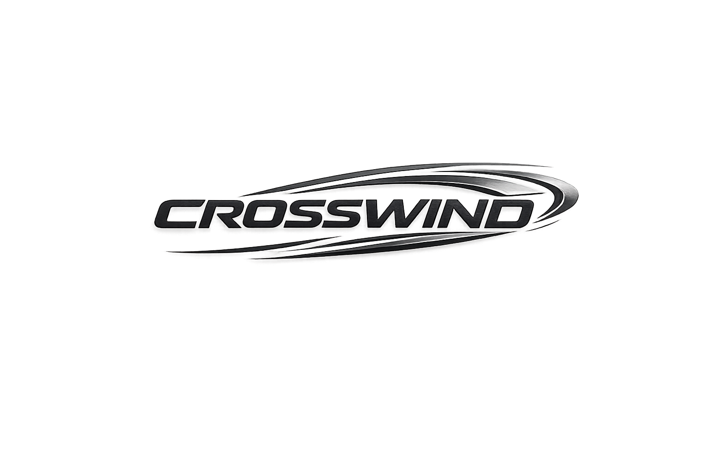

# CrossWind

<p float="left">
  
  
</p>

CrossWind is a dual-platform motor controller project for Iron Pine Outdoors. It includes a classic Arduino sketch for AVR boards and an ESP32 version with BLE remote control and persistent settings.

## Repository Layout

- `crosswind/` — Classic Arduino sketch for standard AVR boards.
- `crosswind_esp32/` — ESP32 sketch with BLE remote control and persistent settings.
- `assets/img/` — branding assets and logo files used by the README.

## Project Overview

CrossWind drives a bidirectional motor or pump using limit switches, a start/stop button, a mode button, and a speed potentiometer. The controller supports four operating modes:

- `MANUAL` — direct control with the speed pot and automatic direction reversal at limit switches.
- `RANDOM` — randomized direction and speed changes within the selected range.
- `FLUSH` — randomized flush sequences with safe pause/run timing.
- `CENTERING` — move slowly toward the opposite limit and reverse when reached.

The ESP32 variant adds a BLE control interface and stores the last selected mode, direction, and speed in non-volatile memory.

## Features

### Classic Arduino (`crosswind/`)
- Manual, random, flush, and centering drive modes.
- Soft start/ramp behavior for flush actions.
- Debounced button handling for reliable operation.
- EEPROM persistence backed by packed state records and CRC validation.
- Motor stall timeout protection that stops the motor after sustained commanded motion without a limit transition.
- Hardware watchdog support for reset recovery from stuck firmware loops.
- Built-in limit switch safety and emergency stops.
- Optional serial debug mode via `DEBUG_SERIAL` for troubleshooting.

### ESP32 (`crosswind_esp32/`)
- BLE control with remote commands and status notifications.
- `AUTH=<token>` protected command access, with `HELP`, `PING`, and `STATUS` allowed before authentication.
- Persistent mode, direction, speed, and fault diagnostics across resets.
- BLE preference storage with magic and checksum validation.
- Hardware watchdog support for reset recovery from stuck firmware loops.
- Command length guarding and connected-client-only status notifications.
- Motor stall timeout protection after sustained commanded motion.
- Remote `SAVE`, `INFO`, and `HELP` commands for easier control.
- Safety stop if both limit switches are triggered simultaneously.
- BLE response support for `PING` and `RESET`.

## BLE Command Reference

The ESP32 version accepts simple BLE commands in the form `COMMAND=VALUE`, `COMMAND VALUE`, or `COMMAND`.

- `AUTH=<token>`
- `START` / `RUN`
- `STOP` / `PAUSE`
- `STATUS`
- `PING`
- `RESET`
- `SAVE`
- `INFO`
- `HELP`
- `MODE=MANUAL|RANDOM|AUTO|FLUSH|CENTERING|CENTER`
- `DIRECTION=FORWARD|REVERSE`
- `SPEED=<50-255>`

Example:

```txt
MODE=RANDOM
SPEED=180
START
```

## Hardware

The lessons below are conceptual. Use the final wiring and motor driver based on your specific hardware.

- `RPWM` / `LPWM` — PWM outputs for right and left motor channels.
- `R_EN` / `L_EN` — enable pins for the motor driver.
- `LEFT_LIMIT` / `RIGHT_LIMIT` — limit switch inputs with `INPUT_PULLUP`.
- `START_STOP_BUTTON` — start/stop toggle button.
- `MODE_BUTTON` — mode select button.
- `SPEED_POT` — analog speed control.
- `STATUS_LED` — status indicator.

## Getting Started

1. Open the appropriate folder in the Arduino IDE or an ESP32-compatible environment.
2. Install board support for the selected platform.
3. Select the correct board and serial port.
4. Upload the sketch.

## Development Notes

- `crosswind/crosswind.ino` is designed for standard Arduino boards and uses `analogWrite()` for PWM.
- `crosswind_esp32/crosswind_esp32.ino` uses ESP32 PWM channels via `ledcSetup()` and `ledcAttachPin()`.
- Keep platform-specific wiring and code separate to avoid cross-platform mistakes.

## Asset Usage

Logos are stored in `assets/img/` and displayed in this README for branding.

## License

This repository does not include a license yet. Add a `LICENSE` file if you want to define usage and distribution rights.